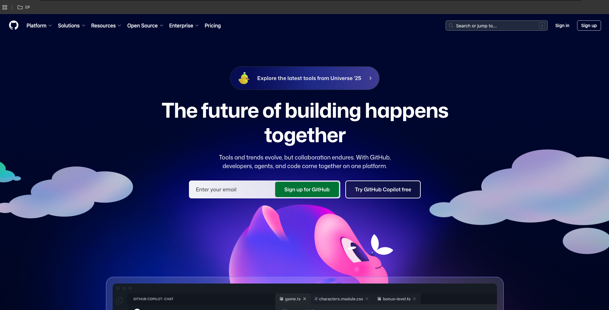
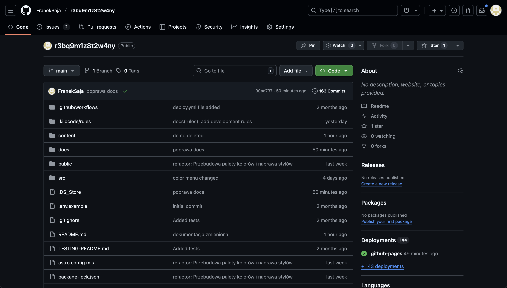
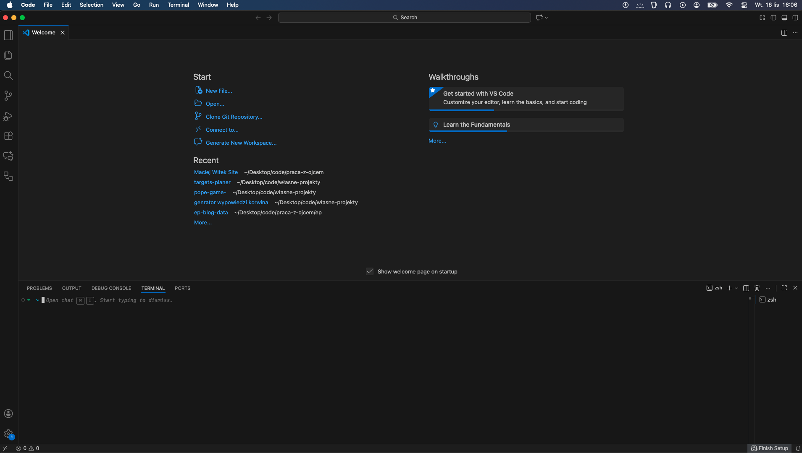
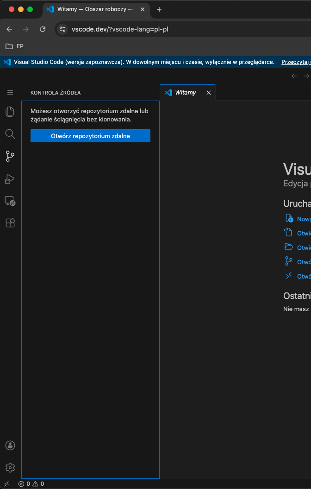
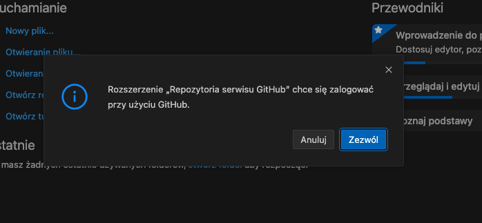
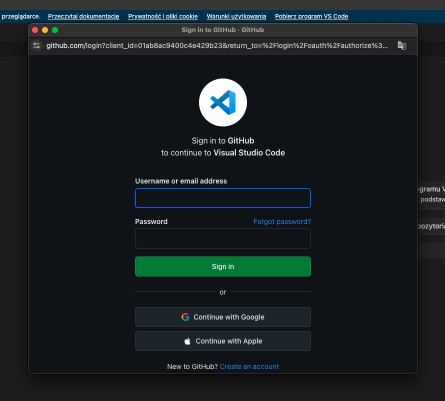
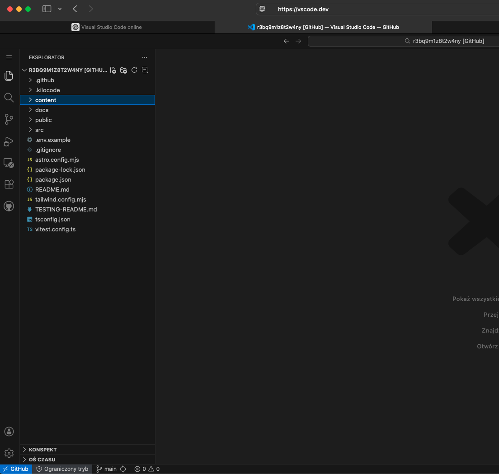
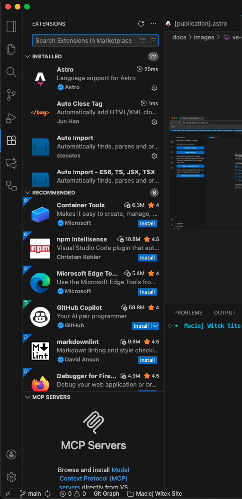
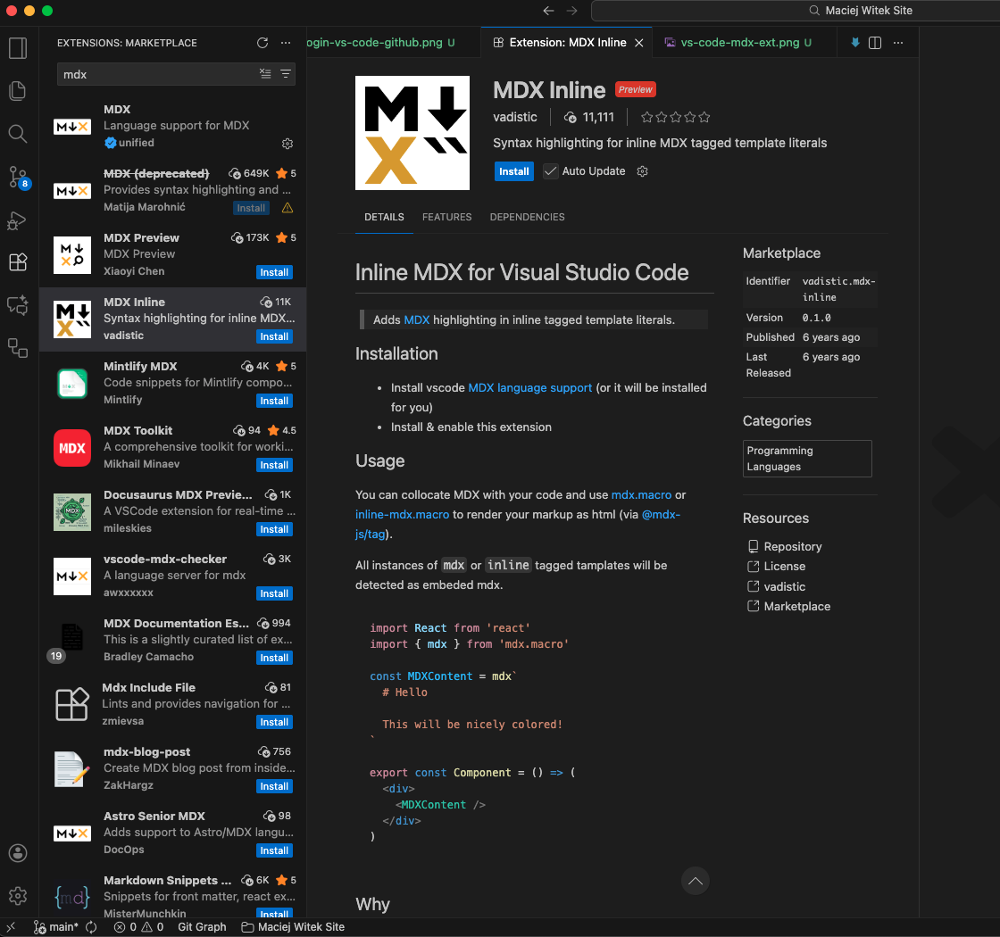

# Krok 1: Przygotowanie do pracy.

Witaj! Ten rozdział pomoże Ci jednorazowo skonfigurować komputer, abyś mógł swobodnie edytować treść strony.

### 1.1. Konto na GitHub

**GitHub** to serwis, na którym przechowywany jest kod Twojej strony. Umożliwia on bezpieczne zarządzanie plikami i śledzenie wszystkich wprowadzanych zmian.

1.  Odwiedź stronę [https://github.com/](https://github.com/).

2.  Załóż darmowe konto, postępując według wyświetlanych tam wskazówek.

3.  Zaakceptuj zaproszenie do projektu, które otrzymałeś w formie linku.
4.  W panelu głównym (Dashboard) GitHuba, po lewej stronie, znajdziesz listę projektów (repozytoriów), do których masz dostęp. Kliknij w nazwę repozytorium, nad którym chcesz pracować. Po wejściu w repozytorium twojego projektu powinieneś zobaczyć taki interfejs :



---

### 1.2. Edytor Visual Studio Code (VS Code)


**Visual Studio Code** to program, który posłuży Ci jako główne narzędzie do edycji plików z treścią.

1.  Przejdź na stronę [https://code.visualstudio.com/](https://code.visualstudio.com/).

2.  Pobierz wersję programu odpowiednią dla Twojego systemu (Windows lub macOS).
3.  Zainstaluj program, korzystając z domyślnych ustawień instalatora.


---

### 1.3. System kontroli wersji Git

**Git** to narzędzie działające w tle, które współpracuje z VS Code i GitHubem, umożliwiając pobieranie i zapisywanie zmian.

1.  Odwiedź stronę [https://git-scm.com/downloads](https://git-scm.com/downloads).


2.  Pobierz i zainstaluj wersję dla swojego systemu, również zgadzając się na domyślne ustawienia.


---


### 1.4. Konfiguracja Git (jednorazowa)

Zanim zaczniesz pracę, musisz jednorazowo "przedstawić się" systemowi Git. Dzięki temu Twoje zmiany będą prawidłowo podpisane.
1. Otwórz VS Code.

1.  W VS Code otwórz zintegrowany terminal, wybierając z górnego menu **"Terminal" -> "New Terminal"**.

2.  W oknie terminala, które pojawi się na dole ekranu, wpisz i zatwierdź (wciskając Enter) kolejno dwie poniższe komendy. Pamiętaj, aby wstawić swoje prawdziwe dane.

    ```bash
    git config --global user.name "Twoje Imię i Nazwisko"
    git config --global user.email "twoj-adres@email.com"
    ```

To wszystko. Ta konfiguracja jest jednorazowa i zostanie zapamiętana na skonfigurowanym komputerze.

---

### 1.5. Pobranie plików strony

Teraz możesz pobrać pliki strony na swój komputer.

1.  Otwórz program **Visual Studio Code**.

 Na ekranie powitalnym, który się pojawi, kliknij przycisk **"Clone Git Repository"**.

    

2.  W polu, które się pojawi, wklej adres repozytorium: `https://github.com/przykladowy-user/przykladowe-repo.git` i zatwierdź.

    

3.  Gdy program zakończy pobieranie, potwierdź chęć otwarcia projektu, klikając **"Open"**.

Świetnie, wszystko gotowe. Pliki strony znajdują się teraz na Twoim komputerze i możesz przystąpić do ich edycji.

---
# Droga alternatywna - vs code online.

Zero instalacji zewnętrznych programów na komputer. Wszystko z przeglądarki.

1. Tak samo, jak w pierwszej opcji, musisz założyć konto na GitHub i wejść do repozytorium z kodem strony (Patrz na samej górze)

2. Otwórz stronę https://vscode.dev


3. Wejdź do zakładki Source Controle na lewym Menu i wybierz "Otwórz repozytorium zdalne"


4. Proces klonowania repozytorium wygląda niemal tak samo jak w lokalnej wersji vs code. Wklej adres URL repozytorium w pole, które pojawi się na górze strony

5. Po kliknięciu "Enter" strona pokaże taki komunikat :

Kliknij "Zezwól"

6. Teraz musisz zalogować się swoim loginem i hasłem do serwisu GitHub :


7. Możliwe, że repozytorium nie skopiuje się od razu. Wtedy trzeba powtórzyć cały proces. Jeszcze raz kliknij "Otwórz repozytorium zdalne"
. W okienku, które pojawi się na górze, wybierz opcje "Otwórz repozytorium GitHub". Pojawi się lista repozytoriów przypisanych do konta na które się zalogowałeś. Wybierz swoje repozytorium. Proces klonowania plików potrwa około minuty

8. Po zakończeniu procesu pliki strony powinny wyświetlić się po lewej stronie ekranu :


9. Teraz coś co ułatwi ci pracę. vs-code-online nie podświetla wszystkich plików mdx automatycznie, a kolorowy tekst to coś co znacznie ułatwi czytanie składni mdx. Aby tekst w plikach mdx podświetlał się na kolorowo, musisz pobrać odpowiednią wtyczkę. Otwórz zakładkę Extensions w lewym Menu:

Wyszukaj frazę "mdx". Następnie wybierz wtyczkę o nazwie "MDX Inline"

Kliknij Install. Instalacja potrwa około sekundy
Gotowe. vs code online jest skonfigurowane. Proces Commitowania i pushowania jest taki sam jak w vs-code lokalnym. Patrz [krok 4](4-publikacja-zmian.md)

---
[Przejdź do następnego kroku ->](2-zarzadzanie-trescia.md)
