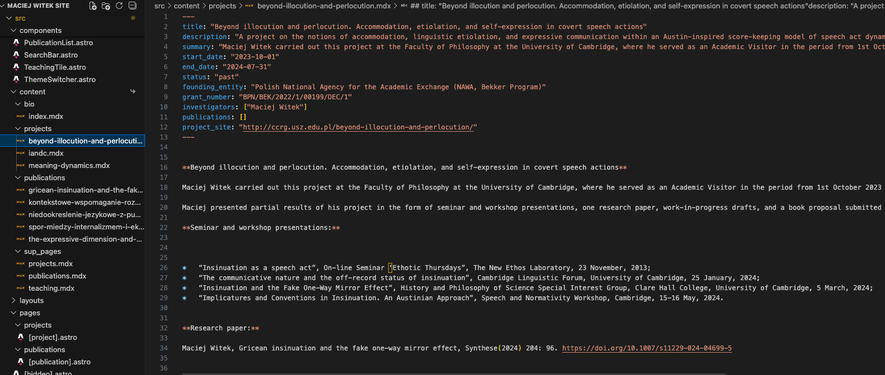
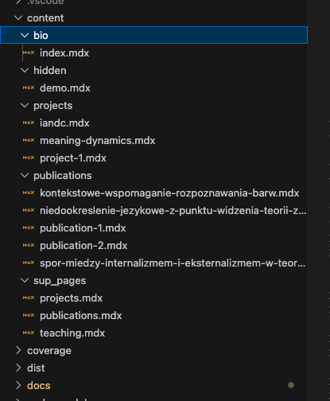

# Krok 2: Jak zarządzać plikami?

Cała treść Twojej strony znajduje się w plikach z rozszerzeniem `.mdx`, które znajdują się w katalogu `content`. W tym rozdziale dowiesz się, jak je edytować, dodawać i usuwać.

### 2.1. Budowa pliku `.mdx`

Każdy plik z treścią ma dwuczęściową budowę, która pozwala elastycznie zarządzać informacjami.

*   **Metadane (górna część):** To zestaw **kontenerów na treść** o sztywnej, z góry zdefiniowanej strukturze. Wypełniasz w nich pola takie jak `tytuł`, `data` czy `autor`. To fundament każdej podstrony.

   

*   **Treść właściwa (dolna część):** To przestrzeń przeznaczona na **duże bloki tekstu**, gdzie potrzebna jest większa swoboda formatowania (np. akapity, listy, nagłówki). Choć w niektórych typach treści (jak publikacje) ta część bywa pusta, pełni ona ważną rolę.

### 2.2. Edycja istniejącej treści

1.  W panelu plików po lewej stronie VS Code znajdź katalog `content` i otwórz plik, który chcesz zmodyfikować.

2.  Wprowadź potrzebne zmiany w tekście. Konkretna instrukcja jak poprawnie edytować plik `.mdx`, tak aby nie wygenerować błędu jest w [Krok 3](3-przewodnik-po-tresciach.md)
3.  Zapisz plik za pomocą skrótu `Ctrl + S` (Windows) lub `Cmd + S` (macOS).

### 2.3. Dodawanie nowej treści (np. projektu)

1.  W panelu plików kliknij prawym przyciskiem myszy na folder, w którym chcesz umieścić nowy wpis (np. `content/projects`).
2.  Wybierz opcję **"New File"**.
3.  Nadaj plikowi prostą nazwę, używając małych liter i myślników zamiast spacji (np. `nowy-projekt-badawczy.mdx`). Pamiętaj o rozszerzeniu `.mdx`.
4.  Aby zachować spójną strukturę, skopiuj zawartość z innego, istniejącego pliku i dostosuj ją do swoich potrzeb. Konkretna instrukcja jak poprawnie tworzyć plik `.mdx`, tak aby nie wygenerować błędu jest w [Krok 3](3-przewodnik-po-tresciach.md)

### 2.4. Usuwanie treści

1.  W panelu plików kliknij prawym przyciskiem myszy na plik, który chcesz usunąć.
2.  Wybierz opcję **"Delete"** i potwierdź swój wybór.

**UWAGA. Aby jaka kolwiek zmiana była widoczna na stronie, należy opublikować nową wersję kodu w repozytorium GitHub. Instrukcja jak to zrobić, znajduje się w [Krok 4: Publikacja Zmian](4-publikacja-zmian.md)**

### 2.5. Automatyczne tworzenie podstron i tworzenie nowych elementów list projektów i publikacji

Warto wiedzieć, że strona została zaprojektowana tak, aby ułatwić Ci pracę.

Gdy dodasz nowy plik `.mdx` do folderu z projektami lub publikacjami i uzupełnisz go wymaganymi danymi, po zapisaniu i opublikowaniu zmian (commit i push) system automatycznie utworzy dla niego nową podstronę i doda odpowiedni wpis na liście zbiorczej. Nie musisz wykonywać żadnych dodatkowych kroków – wystarczy, że stworzysz plik z treścią i opublikujesz zmiany na GitHub.