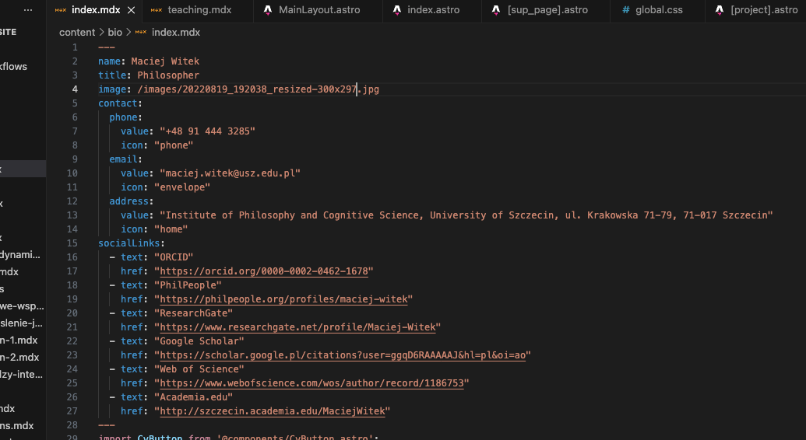
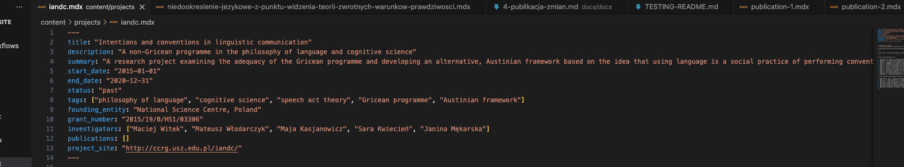

# Krok 3: Gdzie znaleźć i jak edytować treść?

Ten rozdział pomoże Ci zlokalizować pliki `.mdx` odpowiedzialne za konkretne sekcje na stronie i opisze Ci ich zawartość

---

### 3.1. Znaczenie metadanych

Jak już wiesz, każdy plik `.mdx` zaczyna się od sekcji metadanych. Poniżej znajdziesz przypomnienie poprawnego zapisu:

**Przykład:**
```
---
title: "Tytuł projektu"
description: "Krótki opis, który pojawi się na liście projektów."
type: "current"
---
```

Prawidłowe i spójne wypełnianie metadanych jest ważne dla właściwego działania strony. Jeżeli w składni tego zapisu pojawi się błąd, strona nie zbuduje się prawidłowo

**Równie ważne jest przemyślane nazywanie plików `.mdx`**. Nazwa pliku (np. `moj-nowy-projekt.mdx`) jest automatycznie przekształcana na adres URL podstrony (np. `twojadomena.com/projects/moj-nowy-projekt`). Dlatego używaj nazw, które są krótkie, czytelne i trafnie opisują zawartość – wpłynie to pozytywnie na nawigację i SEO.

---

### 3.2. Lokalizacja plików

Oto lista najważniejszych miejsc, w których znajdziesz pliki do edycji:

-   **Strona główna (ABOUT):**
    -   **Plik:** `content/bio/index.mdx`
    -   **Zawartość:** Główny tekst biograficzny.

-   **Projekty (PROJECTS):**
    -   **Folder:** `content/projects/`
    -   **Zawartość:** W tym folderze każdy plik `.mdx` to osobny projekt.

-   **Publikacje (PUBLICATIONS):**
    -   **Folder:** `content/publications/`
    -   **Zawartość:** Analogicznie do projektów, każdy plik `.mdx` w tym folderze to osobna publikacja.

-   **Dydaktyka (TEACHING):**
    -   **Plik:** `content/sup_pages/teaching.mdx`
    -   **Zawartość:** Treść podstrony poświęconej dydaktyce.

 ---

### 3.3. Metadane i ich walidacja

Każdy rodzaj treści (biografia, projekt, publikacja) posiada własny, ściśle zdefiniowany zestaw metadanych. Jest to kluczowe dla spójności i poprawnego działania strony. Poniżej znajdziesz szczegółowy opis wymaganych i opcjonalnych pól dla każdej sekcji. Kolejność podawania metadanych w pliku nie ma znaczenia

**Ważne:** System automatycznie weryfikuje poprawność metadanych. Jeśli pominiesz wymagane pole, podasz je z błędem lub dodasz pole, które nie jest zdefiniowane w konfiguracji, strona nie zostanie opublikowana, a w interfejsie repozytorium na GitHub  zobaczysz komunikat o błędzie :


Więcej o procesie publikacji strony i obsłudze błędów znajdziesz w [Krok 4: Publikacja Zmian](4-publikacja-zmian.md)

---

#### **Strona główna (ABOUT)**
**Plik:** `content/bio/index.mdx`

-   **Wymagane:**
    -   `name`: Imię i nazwisko.
    -   `title`: Tytuł zawodowy lub specjalizacja.
-   **Opcjonalne:**
    -   `email`: Adres e-mail.
    -   `image`: Ścieżka do zdjęcia.
    -   `cv_url`: Link do CV.
    -   `contact`: Dane kontaktowe (telefon, e-mail, adres).
    -   `socialLinks`: Lista linków do mediów społecznościowych.

Strona ABOUT jako jedyna ma specyficzną, ale prostą budowę metadanych. Mimo to, na wszelki wypadek zamieszczone jest zdjęcie przedstawiające prawidłowy układ metadanych w pliku `index.mdx`:



---

#### **Projekty (PROJECTS)**
**Folder:** `content/projects/`

-   **Wymagane:**
    -   `title`: Tytuł projektu.
    -   `description`: Krótki opis widoczny na liście projektów.
-   **Opcjonalne:**
    -   `date`: Data (używane do sortowania).
    -   `summary`: Dłuższy opis.
    -   `status`: Status projektu. Może przyjąć jedną z dwóch wartości: `current` (dla bieżących) lub `past` (dla archiwalnych).
    -   `start_date`: Data rozpoczęcia.
    -   `end_date`: Data zakończenia.
    -   `tags`: Tagi lub słowa kluczowe. Listę należy sformatować w następujący sposób:
        ```
        ["Tag 1", "Tag 2"]
        ```
    -   `founding_entity`: Instytucja finansująca.
    -   `grant_number`: Numer grantu.
    -   `investigators`: Lista badaczy. Formatowanie jest takie samo jak w przypadku tagów:

        ```
         ["Anna Nowak", "Jan Kowalski"]
        ```
    -   `publications`: Powiązane publikacje.
    -   `project_site`: Link do strony projektu.

---

#### **Publikacje (PUBLICATIONS)**
**Folder:** `content/publications/`

-   **Wymagane:**
    -   `title`: Tytuł publikacji.
    -   `abstract`: Abstrakt.
    -   `author`: Autor/autorzy.
    -   `keywords`: Słowa kluczowe. Formatowanie jest takie samo jak w przypadku tagów:
        ```
        ["Słowo kluczowe 1", "Filozofia"]
        ```
    -   `publicationDate`: Data publikacji.
    -   `lang`: Język publikacji. Może przyjąć jedną z dwóch wartości: `pl` (dla polskiego) lub `en` (dla angielskiego).
-   **Opcjonalne:**
    -   `preprint`: Link do preprintu.
    -   `journalLink`: Link do czasopisma.
    -   `pdfFile`: Ścieżka do pliku PDF.

---

#### **Dydaktyka (TEACHING)**
**Plik:** `content/sup_pages/teaching.mdx`

-   **Wymagane:**
    -   `id`: Identyfikator strony (musi mieć wartość `teaching`).
    -   `title`: Tytuł strony.

---

### 3.4. Przykład w praktyce

Aby zobaczyć, jak wszystkie te elementy łączą się w całość, spójrz na poniższy przykład. Jest to kompletna sekcja metadanych dla jednego z projektów.


Przykład poprawnie wprowadzonych metadanych na podstawie pliku w `content/projects`:



---

### 3.5. Formatowanie treści i Komponenty Astro

#### Formatowanie treści w plikach .mdx

W plikach `.mdx`, w których nie użyto specjalnych **komponentów Astro** (Poznasz je po zielonym kolorze tekstu), możesz swobodnie pisać i formatować tekst pod sekcją z metadanymi. Działa to podobnie do edytora tekstu – możesz używać nagłówków, list, pogrubienia itp.

**Uwaga:** Chociaż system nie zgłosi błędu, jeśli wprowadzisz tekst w sposób nieustrukturyzowany, może to negatywnie wpłynąć na wygląd strony. Aby mieć pewność, że treść będzie wyświetlać się poprawnie, warto trzymać się standardowych zasad formatowania.

> Więcej o tym, jak formatować tekst (np. tworzyć nagłówki, listy, wstawiać linki), dowiesz się na stronie: [https://www.markdownguide.org](https://www.markdownguide.org).

#### Czym są Komponenty Astro?

Komponenty Astro to reużywalne fragmenty strony, które pełnią określone funkcje. Zamiast tworzyć od zera np. listę projektów, używamy gotowego komponentu, który automatycznie pobiera dane i wyświetla je w odpowiedni sposób. Upraszcza to zarządzanie treścią i zapewnia spójny wygląd strony.

W niektórych plikach `.mdx` używamy tych komponentów do automatycznego generowania treści. Oznacza to, że nie piszesz w nich bezpośrednio tekstu, a jedynie wstawiasz odpowiedni komponent.

#### Pliki `.mdx` używające komponentów Astro

Poniższe pliki zamiast standardowego tekstu, wykorzystują komponenty do dynamicznego wyświetlania zawartości:

-   `content/bio/index.mdx` (strona **ABOUT**)
-   `content/sup_pages/projects.mdx` (strona **PROJECTS**)
-   `content/sup_pages/publications.mdx` (strona **PUBLICATIONS**)
-   `content/sup_pages/teaching.mdx` (strona **TEACHING**)

Oto jak wygląda przykładowy plik (`content/sup_pages/projects.mdx`), który używa komponentów:


#### Objaśnienie użytych komponentów

Oto lista komponentów, których użyto w powyższych plikach, wraz z wyjaśnieniem ich funkcji:

-   **`<CvButton text="Pobierz CV" file="documents/cv.pdf" />`**
    -   **Gdzie:** `content/bio/index.mdx`
    -   **Co robi:** Wyświetla przycisk, który pozwala użytkownikowi pobrać CV.
    -   **Wymagane parametry:**
        -   `text`: Tekst, który pojawi się na przycisku (np. "Pobierz CV").
        -   `file`: Ścieżka do pliku CV w folderze `public/` (np. "documents/cv.pdf").
    -   Edytować jedynie treść parametrów

-   **`<SearchBar />`**
    -   **Gdzie:** `content/sup_pages/projects.mdx` i `content/sup_pages/publications.mdx`
    -   **Co robi:** Tworzy pole do wyszukiwania, które pozwala filtrować listę projektów lub publikacji po wpisaniu szukanej frazy. Nie wymaga dodatkowych parametrów.
    -   Nie edytować 

-   **`<ProjectList />`**
    -   **Gdzie:** `content/sup_pages/projects.mdx`
    -   **Co robi:** Automatycznie generuje i wyświetla listę wszystkich projektów (zarówno bieżących, jak i archiwalnych) na podstawie plików `.mdx` z folderu `content/projects/`. Nie wymaga dodatkowych parametrów.
    -   Nie edytować

-   **`<PublicationList />`**
    -   **Gdzie:** `content/sup_pages/publications.mdx`
    -   **Co robi:** Działa analogicznie do `ProjectList`, ale tworzy listę publikacji na podstawie plików z folderu `content/publications/`. Nie wymaga dodatkowych parametrów.
    -   Nie edytować

-   **`<TeachingTile title="Dydaktyka" />`**
    -   **Gdzie:** `content/sup_pages/teaching.mdx`
    -   **Co robi:** Wyświetla specjalnie sformatowany blok (kafelek) z informacjami na temat dydaktyki.
    -   **Wymagane parametry:**
        -   `title`: Główny tytuł kafelka, który będzie wyświetlać się jako jego nagłówek
    -   Edytować jedynie treść parametrów


#### Ważne!

Komponenty muszą być zapisane w nienaruszonej formie, np. `<ProjectList />`. Jakakolwiek zmiana w ich nazwie lub strukturze (np. usunięcie nawiasów `< >` lub ukośnika `/`) spowoduje błąd.

**Równie ważne jest podanie wszystkich wymaganych parametrów.** Jeśli komponent oczekuje parametru (np. `text` w `<CvButton />`), a nie zostanie on podany, strona również się nie zbuduje, a system **GitHub** zgłosi błąd.

Pliki, których w żaden sposób nie zaleca się edytować to `projects.mdx` i `publications.mdx`. Zmiana ich struktury może spowodować błąd. Zostały one zaprojektowane tak, aby nie wymagały żadnych zmian. Aby dodać nowy projekt lub publikację, wystarczy dodać odpowiedni plik `.mdx` w folderze `content/projects/` lub `content/publications/`, co zostało opisane w [Kroku 2](2-zarzadzanie-trescia.md). Komponenty `<ProjectList />` i `<PublicationList />` automatycznie zajmą się resztą.

> Więcej o tym, jak radzić sobie z ewentualnymi błędami, przeczytasz w dokumencie [Krok 4: Publikacja Zmian](4-publikacja-zmian.md).

---
[Przejdź do następnego kroku ->](4-publikacja-zmian.md)