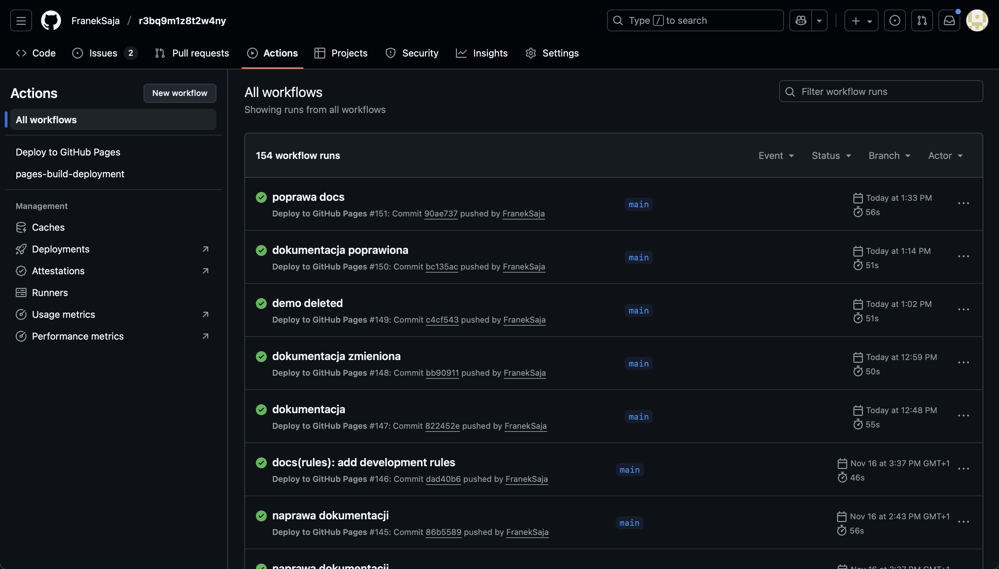
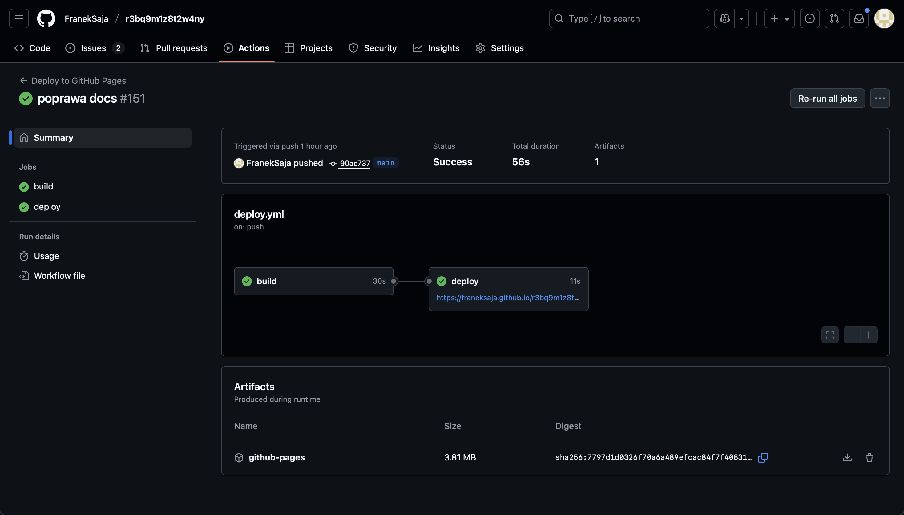
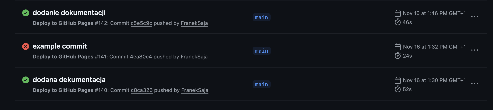

# Krok 4: Jak opublikować zmiany?

Gdy wprowadzisz już wszystkie zmiany i zapiszesz pliki, ostatnim krokiem jest ich publikacja. Dzięki temu staną się widoczne na publicznej stronie internetowej. Cały proces przeprowadzisz wygodnie wewnątrz VS Code. 

**Ta instrukcja zakłada, że konfiguracja Git i GitHub została przeprowadzona poprawnie. Patrz [Krok 1: Pakiet Startowy](1-pakiet-startowy.md).**

### 4.1. Przejdź do panelu kontroli wersji

1.  W panelu po lewej stronie okna VS Code kliknij ikonę przedstawiającą rozgałęzienie (trzecia od góry).
2.  Otworzy się panel **"Source Control"**, w którym zobaczysz listę wszystkich zmodyfikowanych przez Ciebie plików.

### 4.2. Przygotuj zmiany do zatwierdzenia (Stage Changes)

Zanim zatwierdzisz zmiany, musisz wskazać, które z nich chcesz zapisać w "paczce". Ten proces nazywa się "stagingiem".

1.  Najedź kursorem na plik, który chcesz zatwierdzić.
2.  Kliknij ikonę **"+"** (plus), która pojawi się obok nazwy pliku.
3.  Plik zostanie przeniesiony do sekcji **"Staged Changes"**. Oznacza to, że jest gotowy do zatwierdzenia.

### 4.3. Opisz i zatwierdź zmiany (Commit)

Teraz, gdy zmiany są już przygotowane, możesz je ostatecznie zatwierdzić.

1.  W polu tekstowym **"Message"** wpisz krótko, co zostało zmienione, np. "Dodanie nowego projektu" lub "Poprawki w biografii".
2.  Kliknij przycisk **"Commit"**.

### 4.4. Zsynchronizuj zmiany z serwerem (Sync Changes)

Ostatni etap to wysłanie przygotowanej "paczki" na serwer.

1.  Po zatwierdzeniu zmian, na niebieskim pasku na samym dole okna VS Code pojawi się przycisk **"Sync Changes"**, zwykle z ikoną kręcących się strzałek.
2.  Kliknij go, aby wysłać swoje zmiany.

Po chwili synchronizacja się zakończy. Twoje modyfikacje zostały opublikowane i wkrótce pojawią się na stronie.

---

## Przewodnik po GitHub i obsługa błędów

Po wysłaniu zmian na serwer, proces publikacji jest kontynuowany na platformie GitHub. Poniżej znajdziesz informacje, jak śledzić postęp i co robić, gdy coś pójdzie nie tak.

### Gdzie widać najnowszą zmianę?

Najnowsza zmiana jest widoczna od razu na głównej stronie projektu w sekcji **Code**. Zobaczysz tam informację o ostatnim zatwierdzeniu (commicie) oraz status wdrożenia (deploymentu).

- **Zielony "ptaszek"** oznacza, że wszystko przebiegło pomyślnie, a zmiany są już widoczne na stronie.
- **Czerwony "krzyżyk"** oznacza, że wystąpił błąd.

### Historia i szczegóły wdrożeń (zakładka Actions)

Pełną historię wszystkich wdrożeń – zarówno tych udanych, jak i nieudanych – znajdziesz w zakładce **Actions**.

Po kliknięciu w konkretną zmianę (konkretny commit) zobaczysz podsumowanie danego wdrożenia.

### Dwa etapy wdrożenia: Build i Deploy

Każda zmiana przechodzi przez dwa główne etapy:

1.  **Build (Budowanie)**: W tym kroku serwer "czyta" wszystkie pliki projektu (w tym pliki `.mdx` z treścią) i na ich podstawie buduje finalną wersję strony.
2.  **Deploy (Wdrożenie)**: Gotowa strona jest umieszczana na serwerze, dzięki czemu staje się publicznie dostępna.

**Ważne:** Jeśli edytujesz **tylko treść** (pliki `.mdx`), ewentualne błędy mogą pojawić się **tylko na etapie "Build"**. Najczęściej wynikają one z nieprawidłowej struktury metadanych (np. brak cudzysłowu, literówka w nazwie pola). Nie musisz w takim przypadku przejmować się etapem "Deploy".

### Jak wygląda i gdzie znaleźć błąd?

Jeśli proces budowania strony się nie powiedzie, zobaczysz czerwony krzyżyk przy nazwie zmiany.

Aby dowiedzieć się więcej o przyczynie błędu, kliknij w szczegóły (czerwony krzyżyk), a następnie przejdź do logów z procesu budowania. Błąd będzie wyraźnie oznaczony, co ułatwi jego zlokalizowanie i naprawę.

